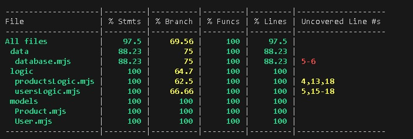

# BOLD TECH

## Descripción
Technology eCommerce website

## Use Cases
- Login
- Register (create user)
- Product reviews
- Publish products
- Filter/search products
- Delete products
- Update user access data (password/email)
- Add to cart

## UI/UX Design
https://www.figma.com/design/nA8mvruTSwsh9xwJOLGxHW/Ecommerce-Website?node-id=5-11&t=ss1rS1Vrt1dorLx2-0

## Technical Description
**Technologies and libraries**
- React
- Vite
- Tailwind
- react-router
- Express
- Node
- Mongo + Mongoose
- Mocha Chai
- Bcrypt / Token Library (jose, jwt, etc)

## Data Models

**Users**
Id: Object Id
Password: string
Email: string
Name: string
Cart: [{
      item: productId,
      ammount: number}
]

**Products**
Id: ObjectId
Name: string,
Description: string,
Price: number
Reviews: [ReviewId]

**Reviews**
Id: object id
Text: string,
Author: UserId
Score: number
Product: ProductId

## Test Coverage

Coverage was measured using c8 with Mocha on both integration and unit tests.

**Summary:**
- Branches ~69%
- Statements ~97.5%
- Functions 100%
- Lines ~97.5%